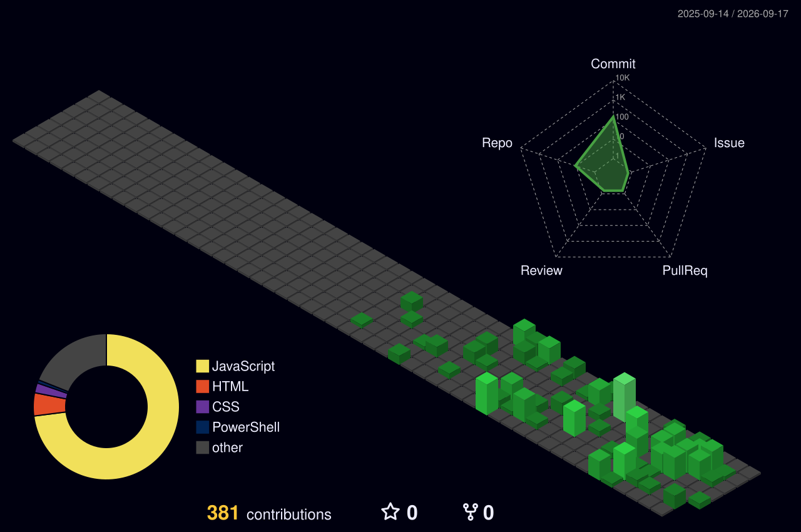

Hi  My name is Abhimanyu Vishwakarma
==============================================================================================================================================

Full Stack Software Developer
-----------------------------

Software Development Engineer specializing in full stack development, backend development, scalable architectures, and automation workflows.

* 🌍  I'm based in Bengaluru, India
* 🖥️  See my portfolio at [MyPortfolio](http://portfolio-mrabhimanyuvishwakarma.vercel.app/)
* ✉️  You can contact me at [abhimanyuvishwakarma9228@gmail.com](mailto:abhimanyuvishwakarma9228@gmail.com)
* 🚀  I'm currently working on [AxePower](http://github.com/mrAbhimanyuVishwakarma/AxePower)
* 🧠  I'm currently learning App Development - Kotlin, Flutter

### Socials

 <a href="https://www.github.com/mrAbhimanyuVishwakarma" target="_blank" rel="noreferrer"> <picture> <source media="(prefers-color-scheme: dark)" srcset="https://raw.githubusercontent.com/danielcranney/readme-generator/main/public/icons/socials/github-dark.svg" /> <source media="(prefers-color-scheme: light)" srcset="https://raw.githubusercontent.com/danielcranney/readme-generator/main/public/icons/socials/github.svg" />  </picture> </a> <a href="https://www.x.com/mrAbhimanyu07" target="_blank" rel="noreferrer"> <picture> <source media="(prefers-color-scheme: dark)" srcset="https://raw.githubusercontent.com/danielcranney/readme-generator/main/public/icons/socials/twitter-dark.svg" /> <source media="(prefers-color-scheme: light)" srcset="https://raw.githubusercontent.com/danielcranney/readme-generator/main/public/icons/socials/twitter.svg" />  </picture> </a> <a href="https://www.linkedin.com/in/mrabhimanyu" target="_blank" rel="noreferrer"> <picture> <source media="(prefers-color-scheme: dark)" srcset="https://raw.githubusercontent.com/danielcranney/readme-generator/main/public/icons/socials/linkedin-dark.svg" /> <source media="(prefers-color-scheme: light)" srcset="https://raw.githubusercontent.com/danielcranney/readme-generator/main/public/icons/socials/linkedin.svg" />  </picture> </a> <a href="https://www.youtube.com/@mrAbhimanyuVishwakarma" target="_blank" rel="noreferrer"> <picture> <source media="(prefers-color-scheme: dark)" srcset="https://raw.githubusercontent.com/danielcranney/readme-generator/main/public/icons/socials/youtube-dark.svg" /> <source media="(prefers-color-scheme: light)" srcset="https://raw.githubusercontent.com/danielcranney/readme-generator/main/public/icons/socials/youtube.svg" />  </picture> </a>

### Badges

<b>My GitHub Stats</b>

<b>Top Repositories</b>

       

     

### Support Me

<ul style="list-style-type: none; margin: 0;">

<li style="display: inline-block; margin-right: 0.25rem;"></li>

</ul>

  

