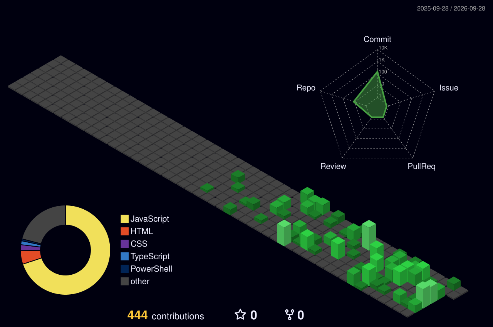

Hi  My name is Abhimanyu Vishwakarma
==============================================================================================================================================

Full Stack Software Developer
-----------------------------
Software Development Engineer specializing in full stack development, backend development, scalable architectures, and automation workflows.

* 🌍  I'm based in Bengaluru, India
* 🖥️  See my portfolio at [MyPortfolio](https://mrabhimanyu.vercel.app/)
* ✉️  You can contact me at [abhimanyuvishwakarma9228@gmail.com](mailto:abhimanyuvishwakarma9228@gmail.com)
* 🚀  I'm currently working on [AxePower](http://github.com/mrAbhimanyuVishwakarma/AxePower)
* 🧠  I'm currently learning App Development - Kotlin, Flutter

  

